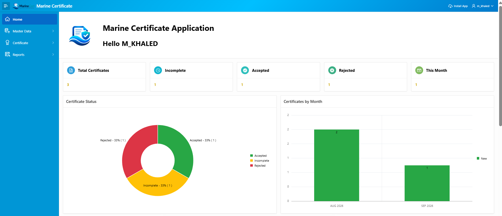
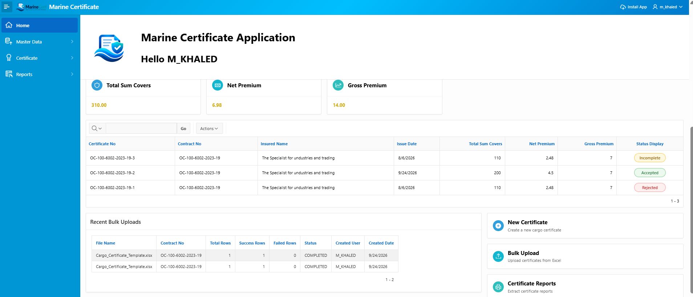
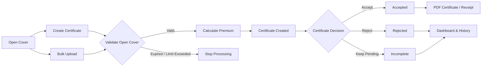

<div align="center">


# MarineCert

**Open Cover & Certificate Workflow**

An Oracle APEX application for managing marine open covers and issuing insurance certificates through a controlled workflow with validation, approval, audit tracking, bulk processing, OTP authentication, dashboards, master data, and PDF reporting.

</div>

---

## Overview

**MarineCert** is an Oracle APEX workflow application designed to manage the lifecycle of marine insurance certificates issued under an **Open Cover**.

A single Open Cover can be used to issue multiple certificates while the application controls two important business limits:

- Certificates must not exceed the Open Cover expiry date.
- The accumulated certificate sum insured must not exceed the available Open Cover sum insured.

Each certificate can then move through its workflow as **Accepted**, **Rejected**, or remain **Incomplete**.

The application also provides certificate audit tracking, bulk certificate creation, email OTP authentication, operational dashboards, master-data maintenance, and printable PDF reports.

---

## Application Preview

### Dashboard Overview

<p align="center">
  
</p>

### Dashboard Details & Operations

<p align="center">
  
</p>

---

## Business Workflow



---

## Main Features

- Open Cover management
- Multiple certificates under one Open Cover
- Open Cover expiry validation
- Open Cover sum insured utilization control
- Automatic certificate number generation
- Certificate creation and editing
- Certificate update and approval audit tracking
- Certificate status workflow
  - Accepted
  - Rejected
  - Incomplete
- Marine premium and charge calculations
- Exchange-rate handling
- Bulk certificate upload from Excel
- Bulk processing status and error tracking
- Email OTP authentication
- Dashboard with certificate statistics
- Premium and sum-cover summaries
- Certificate status charts
- Monthly certificate statistics
- Recent bulk-upload monitoring
- Master-data management
- Marine ports maintenance
- Exchange-rate maintenance
- Open Cover maintenance
- User administration
- PDF certificate and receipt reports
- Oracle BI Publisher integration
- Responsive Oracle APEX interface
- Audit capture for certificate updates, approvals, and rejections

---

## Open Cover Control

MarineCert uses the Open Cover as the main contract controlling certificate issuance.

For every certificate, the application validates that:

```text
Certificate Issue Date <= Open Cover Expiry Date
```

and that the total issued value does not exceed the Open Cover capacity:

```text
Previously Used Sum Covers
+ Current Certificate Sum Covers
<= Open Cover Sum Insured
```

This prevents certificates from being issued against an expired Open Cover or beyond its available insured limit.

---

## Certificate Workflow

Certificates can be created individually or through bulk upload.

After creation, a certificate can remain in one of the following statuses:

| Status | Description |
|---|---|
| **Incomplete** | Certificate is still pending or requires additional action |
| **Accepted** | Certificate has been approved/completed |
| **Rejected** | Certificate has been rejected |

The dashboard presents these statuses visually and provides a quick operational view of certificate activity.

---

## Certificate Audit Tracking

MarineCert captures key user and timestamp information during certificate processing to provide operational traceability.

The current certificate audit behavior includes:

| Action | Audit Fields | Behavior |
|---|---|---|
| **Edit / Update** | `TC_UPD_USER`, `TC_UPD_DATE` | Records the APEX user and update timestamp when an existing certificate in **Incomplete** or **Rejected** status is edited |
| **Reject** | `TC_UPD_USER`, `TC_UPD_DATE` | Records the user and timestamp when an **Incomplete** certificate is rejected |
| **Approve** | `TC_APP_USER`, `TC_APPR_DATE` | Records the approving user and approval timestamp after Open Cover validation succeeds |

Approval is protected by business validation before the certificate status is changed. The application checks the Open Cover capacity and prevents approval when the certificate would exceed the available sum insured.

Accepted certificates are treated as read-only on the certificate form to protect finalized transaction data from further editing.

---

## Premium Calculation

MarineCert contains PL/SQL business logic for calculating certificate financial values, including:

- Freight value
- Incoterm additions
- Total shipment value
- Total sum covers
- Net premium
- Proportional stamp
- Contract stamp
- Supervision fees
- Service fees
- Guarantee fund
- Issuance fees
- Gross premium

Calculation logic is centralized in PL/SQL packages so it can be reused by both manual certificate creation and bulk processing.

---

## Bulk Upload

The application supports creating multiple certificates through an Excel upload process.

The bulk workflow includes:

```text
Upload Excel File
        ↓
Validate Rows
        ↓
Process Certificates
        ↓
Track Success / Failure
        ↓
Display Processing Result
```

The dashboard also displays recent bulk uploads with:

- File name
- Open Cover / Contract number
- Total rows
- Successful rows
- Failed rows
- Processing status
- Created user
- Created date

---

## OTP Authentication

MarineCert includes email-based OTP verification as part of the login process.

The authentication workflow includes:

```text
Username + Password
        ↓
Generate OTP
        ↓
Send OTP by Email
        ↓
Verify OTP
        ↓
Application Login
```

OTP codes are time-limited and validated before access is granted.

---

## Dashboard

The MarineCert dashboard provides an operational summary of the application.

Key indicators include:

- Total Certificates
- Incomplete Certificates
- Accepted Certificates
- Rejected Certificates
- Certificates This Month
- Total Sum Covers
- Net Premium
- Gross Premium

The dashboard also includes:

- Certificate status chart
- Certificates-by-month chart
- Recent certificate list
- Recent bulk-upload activity
- Quick actions for certificate creation, bulk upload, and reporting

---

## Master Data

MarineCert includes dedicated maintenance pages for important reference data.

### Open Cover

Stores the Open Cover information used during certificate issuance, including:

- Policy / Open Cover number
- Issue date
- Expiry date
- Insured name
- Insured address
- Sum insured
- Cover rate

### Exchange Rates

Maintains exchange rates used during premium calculations.

### Marine Ports

Maintains marine country and port reference data used by certificate transactions.

---

## Reports

The application supports printable certificate reports through Oracle APEX report queries and **Oracle BI Publisher**.

Available reporting functionality includes certificate and receipt output in PDF format.

Typical reporting workflow:

```text
Select Certificate
        ↓
Select Report Type
        ↓
Generate Report
        ↓
Download / Print PDF
```

---

## Technology Stack

| Technology | Purpose |
|---|---|
| Oracle APEX 24.2 | Application development and user interface |
| Oracle Database 19c | Database platform |
| PL/SQL | Business rules, validations, calculations, and processing |
| SQL | Reporting and data access |
| Oracle BI Publisher | PDF report generation |
| Oracle Wallet / SMTP | Secure email communication |
| HTML / CSS / JavaScript | UI customization and client-side behavior |
| Excel Upload | Bulk certificate processing |
| Git / GitHub | Source control and repository hosting |

---

## Application Pages

| Page | Purpose |
|---|---|
| Home | Dashboard and operational overview |
| Certificate | Certificate search and management |
| Add/Edit Certificate | Certificate transaction screen |
| Certificate Reports | PDF certificate and receipt generation |
| Certificate Bulk Upload | Excel bulk processing |
| Open Cover | Open Cover master data |
| Add/Edit Open Cover | Open Cover maintenance |
| Exchange Rates | Exchange-rate master data |
| Add/Edit Exchange Rates | Exchange-rate maintenance |
| Marine Ports | Marine ports master data |
| Add/Edit Marine Ports | Marine-port maintenance |
| User Login Page | User administration |
| Login Page | MarineCert authentication and OTP verification |

---

## Project Structure

```text
MarineCert/
│
├── application/
├── readable/
├── workspace/
├── docs/
│   └── images/
│       ├── MarineCert-logo.png
│       ├── dashboard.png
│       └── dashboard2.png
├── .gitignore
├── install.sql
└── README.md
```

### `application/`

Contains the split Oracle APEX application export used for source control and deployment.

### `readable/`

Contains the human-readable Oracle APEX export to make application changes easier to review in Git.

### `workspace/`

Contains workspace-level components included with the Oracle APEX export.

### `install.sql`

Main Oracle APEX installation script generated during export.

### `docs/images/`

Contains the MarineCert branding and dashboard screenshots used in this README.

---

## Installation

### Prerequisites

- Oracle Database 19c
- Oracle APEX 24.2
- Oracle REST Data Services (ORDS)
- Oracle APEX workspace
- Suitable parsing schema
- Oracle BI Publisher when PDF report generation is required

Clone the repository:

```bash
git clone https://github.com/MohamedKhaled6297/MarineCert.git
```

Then import the application using:

```text
Oracle APEX
→ App Builder
→ Import
```

Environment-specific database objects, credentials, mail configuration, and report-server configuration should be configured separately for the target environment.

---

## Environment Configuration

The following settings can vary between environments and should not be hardcoded in source control:

- Database schema
- SMTP configuration
- Email credentials
- Oracle Wallet configuration
- BI Publisher configuration
- ORDS URLs
- Application URLs
- Environment-specific credentials

---

## Security

The public repository should not contain:

- Production passwords
- SMTP passwords
- Gmail App Passwords
- Oracle Wallet passwords
- BI Publisher passwords
- Private encryption keys
- Internal server IP addresses
- Confidential customer information
- Production credentials

MarineCert uses OTP verification to provide an additional authentication step for application access.

---

## Source Control

The application is exported using Oracle APEX split and readable formats so individual pages and shared components can be tracked with Git.

Typical Git workflow:

```bash
git status
git add .
git commit -m "Update MarineCert application"
git push
```

---

## Future Improvements

- Detailed certificate approval history
- Extended field-level audit history
- Notification history
- Configurable email templates
- Additional dashboard analytics
- Enhanced bulk-upload validation
- Additional PDF report templates
- Centralized environment configuration
- API integration
- Automated deployment pipeline
- Unit and integration testing
- Mobile UI optimization

---

## Author

**Mohamed Khaled**

Oracle APEX / PL/SQL / Software Development

---

<p align="center">
  <strong>MarineCert</strong><br>
  Open Cover &amp; Certificate Workflow
</p>
